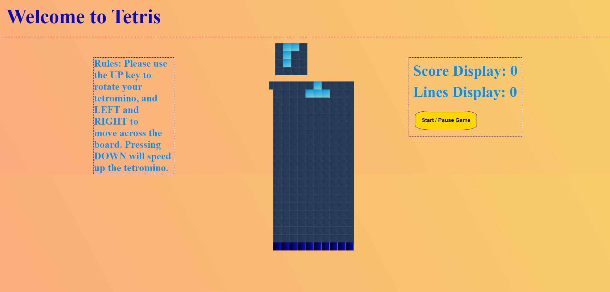

# Tetris Game! 🎮

### Made with JavaScript 🌟

- <a href="https://www.youtube.com/watch?v=lhNdUVh3qCc&t=4931s">Link Video -> Project made thanks to FreeCodeCamp tutorial.</a>
- <a href="https://www.freecodecamp.org/espanol/news/40-proyectos-de-javascript-para-principiantes-ideas-faciles-para-empezar-a-codificar-en-js/">Link to the tutorial of this project and more.</a>

 
  

#### Description

Tetris is a tile-matching puzzle game from the 80’s. Try to get your personal high score by moving each of the 5 randomly selected Tetromino shapes sideways and/or rotating by quarter-turns, so that they form a solid horizontal line without gaps. When such a line is formed, it disappears and any blocks above it fall down to fill the space. For each line you will receive 10 points.

#### Functions

- The game should stop if a Tetrimino fills the highest row of the game board.
- The player should be able to rotate each Tetrimino about its own axis.
- If a line is completed it should be removed and the pieces above should take its place.
- Render a grid-based game in the browser.
- Include separate HTML / CSS / JavaScript files.
- Use Javascript for DOM manipulation.
- Use semantic markup for HTML and CSS.

#### Use

- HTML5
- CSS3
- JavaScript
- Git
